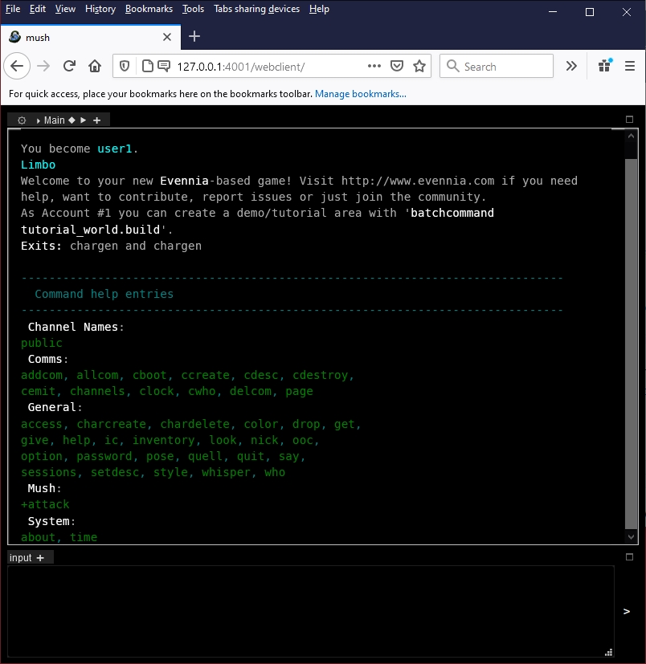

# Projektname #3_team5 - Challenge One Health MUD ( Challenge One Health Multi User Dungeon )

---
## Pitchvideo
Klick to start!

---
## Teammitglieder

* **Rolf Hemmerling** - *Ideengeber:in & Entwicker:in* & *Designer:in* - [GitHub "hemmerling"](https://www.github.com/hemmerling/)

---
## Problemstellung 

Thema #1 des Challenge One Health Hackathons: "Wie kann das öffentliche Gesundheitswesen in Zukunft auf Pandemien vorbereitet werden?"

--- 
## Lösung 
Durch Gamification, Anbieten eines unterhaltsamen ( Online- ) Computer-Spiels, der für das Thema sensibilisiert.

Welche Lösung habt ihr für das Problem entwickelt?

Ein Challenge One Health MUD ( Challenge One Health Multi User Dungeon ).

GamificationIch will einen "Multi User Dungeon" (MUD, http://de.wikipedia.org/wiki/Multi_User_Dungeon ) entwickeln, anhand einer schon auf meinem lokalen Rechner vorhandenen Installation eines "Leeren" Muds, zum 

Hinweis: orientiert euch für die Beschreibung eurer Lösung gerne am [Business Model Canvas](https://www.existenzgruender.de/DE/Gruendung-vorbereiten/Businessplan/Business-Model-Canvas/inhalt.html) (geplante Zielgruppe, konkretes Nutzenversprechen etc.) und erzählt kurz, ob und wie ihr den One Health - Gedanken aufgreift. Dies könnte beispielsweise anhand einer branchenübergreifenden Kooperation oder über einen Ideentransfer aus anderen Branchen erfolgen. Dies erleichtert der Jury die Bewertung eurer Idee.

[![Wikipedia "Multi User Dungeon"]](http://de.wikipedia.org/wiki/Multi_User_Dungeon)

Ein Multi User Dungeon (Abkürzung: MUD, selten auch Multi-User Dimension, Multi-User Domain oder Multi-User Dialog) ist eine üblicherweise textbasierte virtuelle Welt, in der mehrere Spieler (Mudder oder MudHeads) gleichzeitig mittels Computern spielen. MUDs verbinden Eigenschaften von Rollenspielen, Hack and Slays, Player versus Player-Kämpfen, interaktiven Fiktionen und Online-Chats miteinander. Viele MUDs gehören zu den Online-Rollenspielen

---
## Code Repository

[GitHub "hemmerling/challengeonehealthmud"](http://www.github.com/hemmerling/challengeonehealthmud)

---
## Slack Channel

3_team5

---
## Lizenz

MIT Lizenz [LICENSE.md](LICENSE.md)

---
## Was fehlt eurem Projekt noch?
* **Zeit** um sich in das MUD Framework einzuarbeiten, um dann wirklich eine vorführbare Gamification-Anwendung zu haben
* **Online-Plattform**, wo die Gamification-Anwendung gespielt werden kann. Ich werde versuchen, auf einer mir zur Verfügung stehenden Online-Plattform für Python-Anwendungen die MUD-Software zu installieren. Wenn's klappt, wäre die Gamification-Plattform dauerhaft ( kostenlos für mich und die Spieler ) nutzbar.
---
